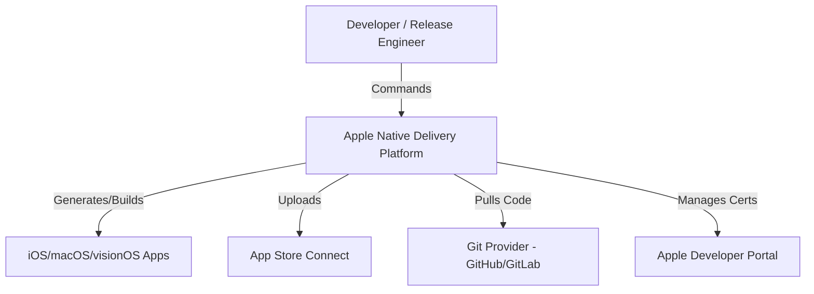
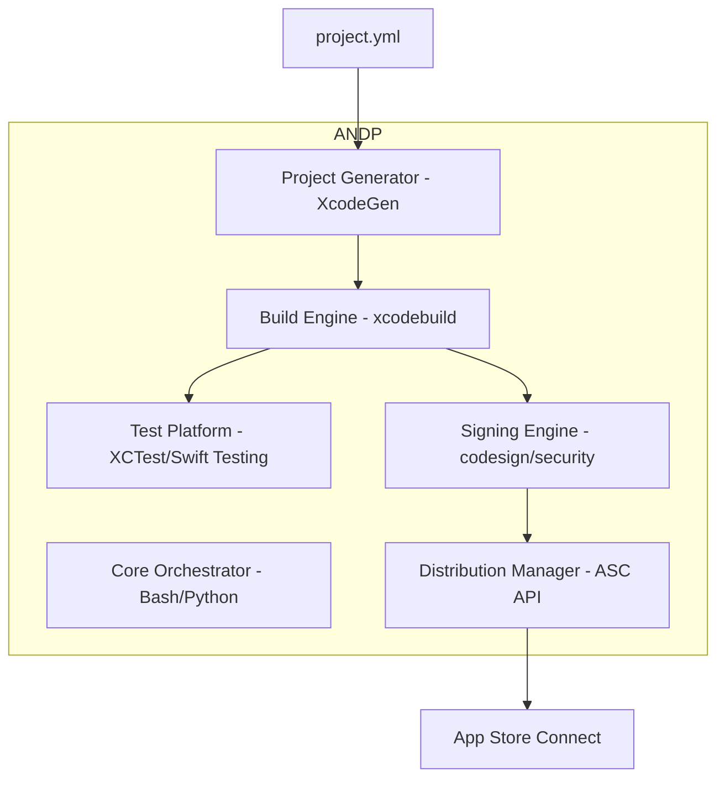
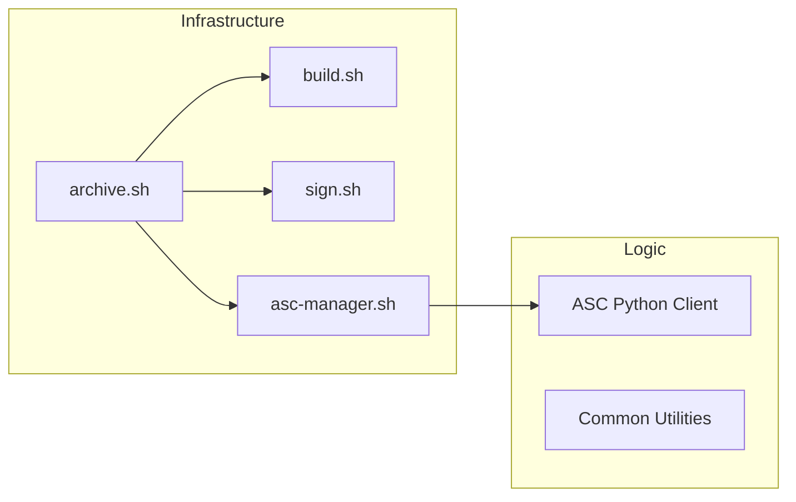
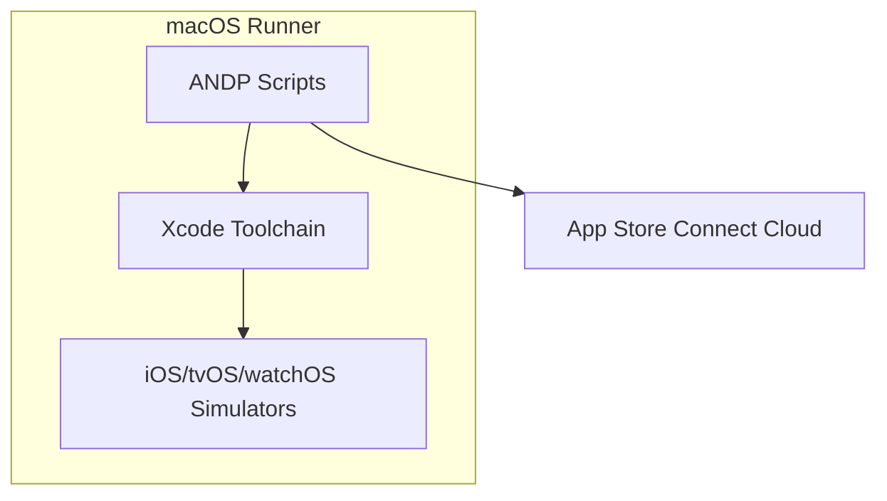
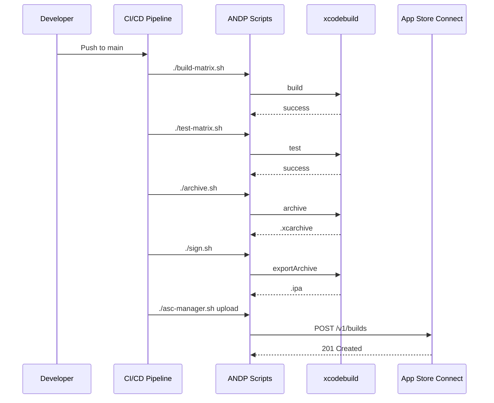
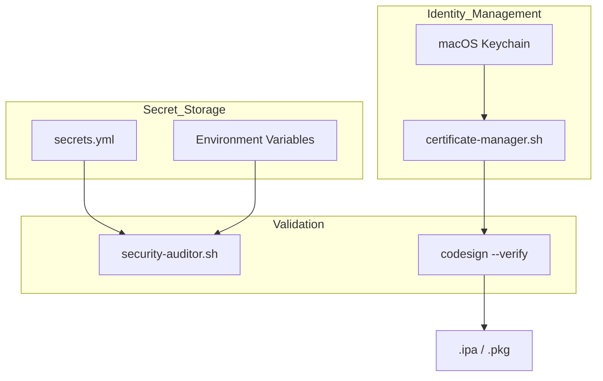
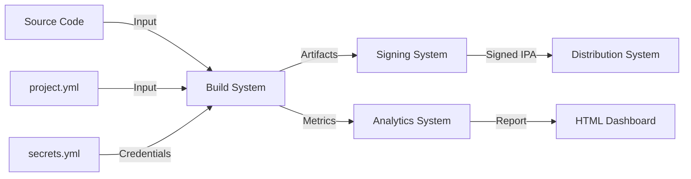

# ANDP Architecture

## System Context Diagram

## Container Diagram

## Component Diagram - Build & Release

## Deployment Diagram

## Sequence Diagram - Full Release Pipeline

## Security Architecture Diagram

## Data Flow Diagram

