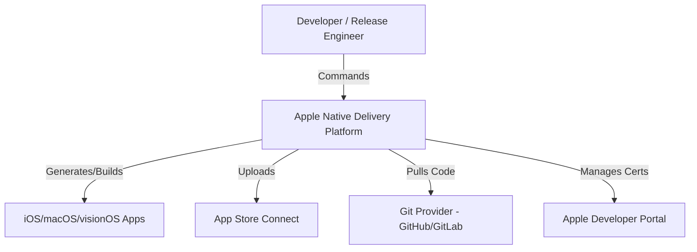
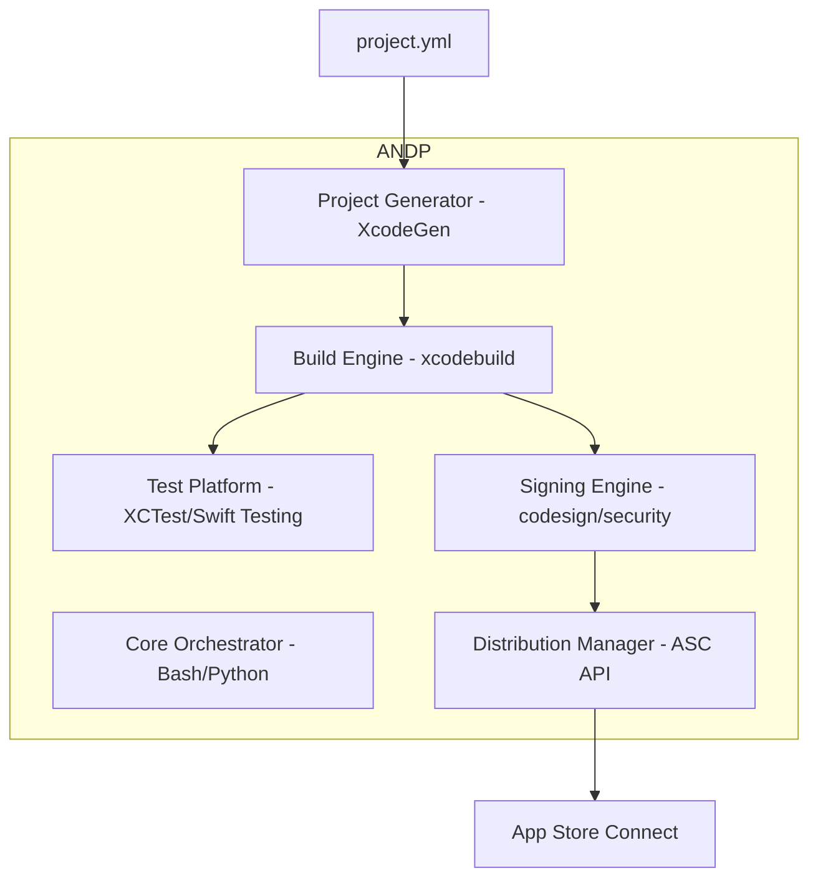
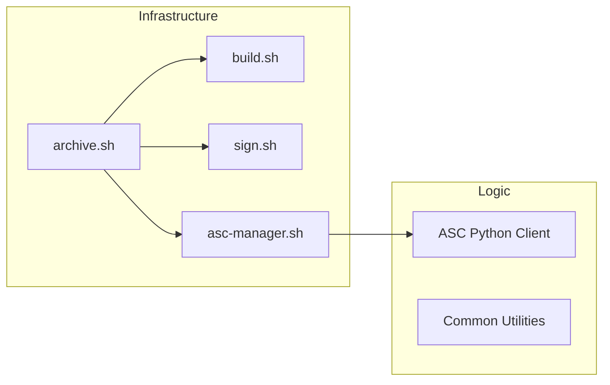
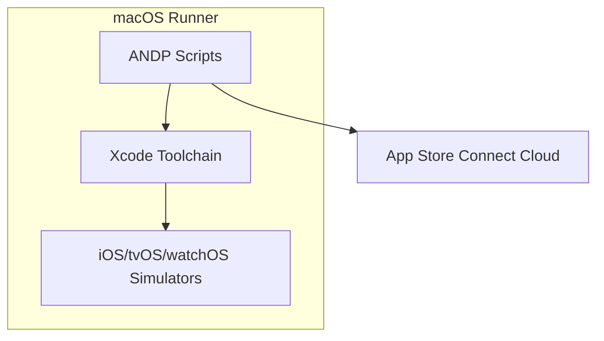

# ANDP Architecture

## System Context Diagram

```mermaid
graph TD
    User[Developer / Release Engineer]
    ANDP[Apple Native Delivery Platform]
    ASC[App Store Connect]
    Git[Git Provider - GitHub/GitLab]
    AppleDev[Apple Developer Portal]

    User -->|Commands| ANDP
    ANDP -->|Generates/Builds| Apps[iOS/macOS/visionOS Apps]
    ANDP -->|Uploads| ASC
    ANDP -->|Pulls Code| Git
    ANDP -->|Manages Certs| AppleDev
```

## Container Diagram

```mermaid
graph TD
    subgraph ANDP
        Core[Core Orchestrator - Bash/Python]
        Gen[Project Generator - XcodeGen]
        Build[Build Engine - xcodebuild]
        Test[Test Platform - XCTest/Swift Testing]
        Sign[Signing Engine - codesign/security]
        Dist[Distribution Manager - ASC API]
    end

    Config[project.yml] --> Gen
    Gen --> Build
    Build --> Test
    Build --> Sign
    Sign --> Dist
    Dist --> ASC[App Store Connect]
```

## Component Diagram - Build & Release

```mermaid
graph LR
    subgraph Infrastructure
        build_sh[build.sh]
        archive_sh[archive.sh]
        sign_sh[sign.sh]
        asc_mgr[asc-manager.sh]
    end

    subgraph Logic
        PythonAPI[ASC Python Client]
        BashHelpers[Common Utilities]
    end

    archive_sh --> build_sh
    archive_sh --> sign_sh
    asc_mgr --> PythonAPI
    archive_sh --> asc_mgr
```

## Deployment Diagram

```mermaid
graph TD
    subgraph CI_Runner[macOS Runner]
        ANDP_Scripts[ANDP Scripts]
        Xcode[Xcode Toolchain]
        Simulator[iOS/tvOS/watchOS Simulators]
    end

    ANDP_Scripts --> Xcode
    Xcode --> Simulator
    ANDP_Scripts --> ASC_Cloud[App Store Connect Cloud]
```
