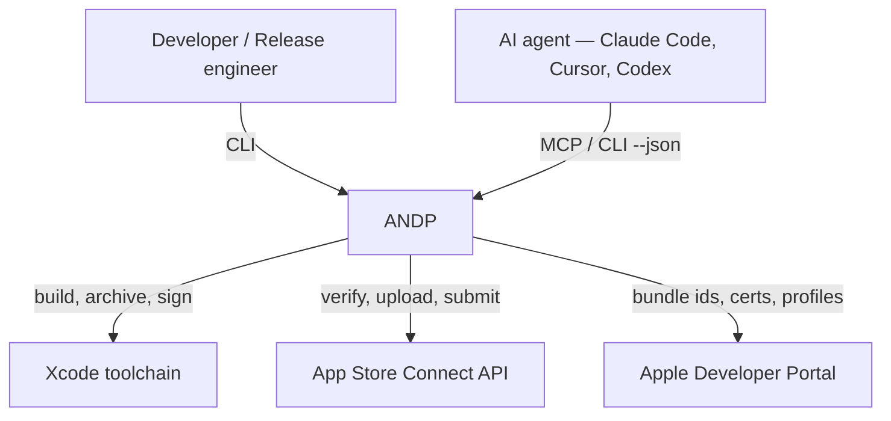
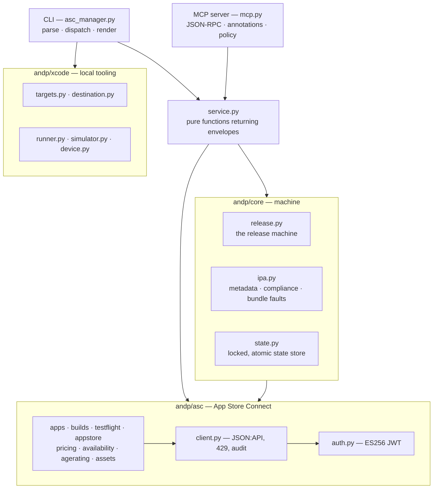
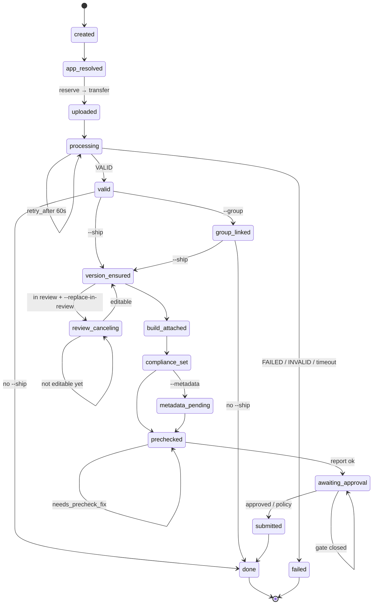
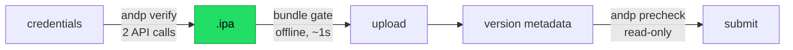
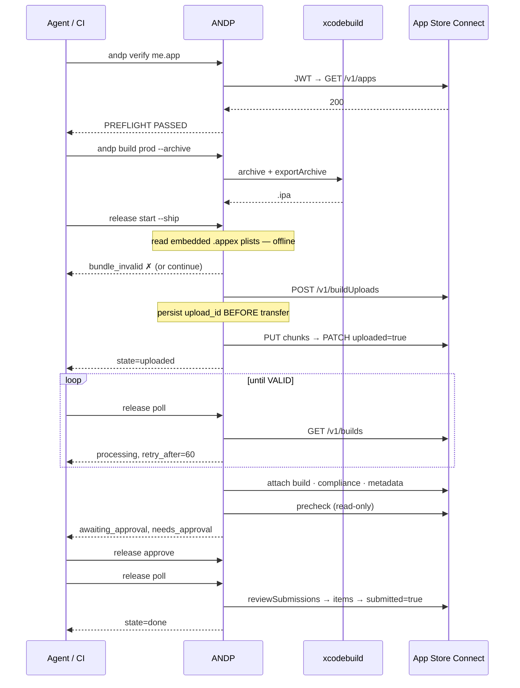
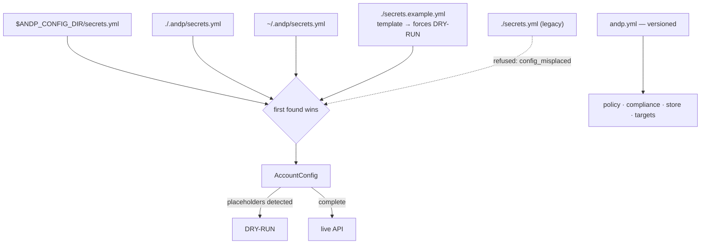
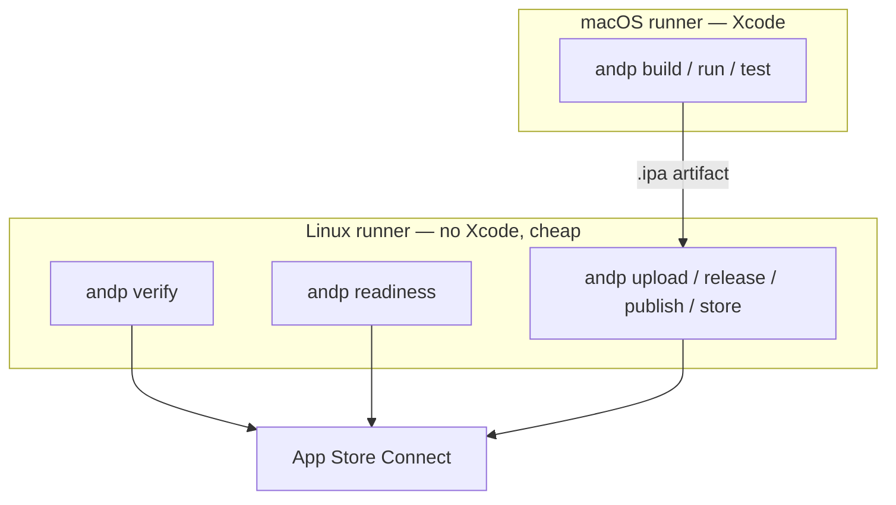

# ANDP architecture

## System context

```mermaid
graph TD
    Dev[Developer / Release engineer]
    Agent[AI agent — Claude Code, Cursor, Codex]
    ANDP[ANDP]
    ASC[App Store Connect API]
    Portal[Apple Developer Portal]
    Xcode[Xcode toolchain]

    Dev -->|CLI| ANDP
    Agent -->|MCP / CLI --json| ANDP
    ANDP -->|build, archive, sign| Xcode
    ANDP -->|verify, upload, submit| ASC
    ANDP -->|bundle ids, certs, profiles| Portal
```

Two front doors, one implementation. The agent is a first-class caller, not an
afterthought wrapped around a human CLI.

## Containers

```mermaid
graph TD
    CLI["CLI — asc_manager.py<br/>parse · dispatch · render"]
    MCP["MCP server — mcp.py<br/>JSON-RPC · annotations · policy"]
    SVC["service.py<br/>pure functions returning envelopes"]

    subgraph core["andp/core — machine"]
        REL[release.py<br/>the release machine]
        IPA[ipa.py<br/>metadata · compliance · bundle faults]
        ST[state.py<br/>locked, atomic state store]
    end

    subgraph asc["andp/asc — App Store Connect"]
        AUTH[auth.py — ES256 JWT]
        CLIENT[client.py — JSON:API, 429, audit]
        MGRS[apps · builds · testflight · appstore<br/>pricing · availability · agerating · assets]
    end

    subgraph xcode["andp/xcode — local tooling"]
        TGT[targets.py · destination.py]
        RUN[runner.py · simulator.py · device.py]
    end

    CLI --> SVC
    MCP --> SVC
    CLI --> xcode
    SVC --> core
    SVC --> asc
    core --> asc
    MGRS --> CLIENT
    CLIENT --> AUTH
```

**`service.py` is the single source of truth.** The CLI owns human rendering,
the MCP server owns the JSON-RPC envelope; neither owns behaviour. That is what
lets the MCP server drive the release machine directly instead of scraping a
CLI's stdout — and what makes one test cover both surfaces.

`andp/xcode` has no arrow to `asc`: a build never talks to Apple and never loads
credentials.

## The release machine

```mermaid
stateDiagram-v2
    [*] --> created
    created --> app_resolved
    app_resolved --> uploaded: reserve → transfer
    uploaded --> processing
    processing --> processing: retry_after 60s
    processing --> valid: VALID
    processing --> failed: FAILED / INVALID / timeout

    valid --> group_linked: --group
    valid --> done: no --ship
    group_linked --> done: no --ship

    valid --> version_ensured: --ship
    group_linked --> version_ensured: --ship
    version_ensured --> build_attached
    build_attached --> compliance_set
    compliance_set --> metadata_pending: --metadata
    compliance_set --> prechecked
    metadata_pending --> prechecked
    prechecked --> prechecked: needs_precheck_fix
    prechecked --> awaiting_approval: report ok
    awaiting_approval --> awaiting_approval: gate closed
    awaiting_approval --> submitted: approved / policy
    submitted --> done

    version_ensured --> review_canceling: in review + --replace-in-review
    review_canceling --> review_canceling: not editable yet
    review_canceling --> version_ensured: editable

    done --> [*]
    failed --> [*]
```

Self-loops are **waiting** states, not failures: a release parked there is
healthy and never forces a re-upload. Reference: [Release.md](../Release.md).

## Where validation happens

```mermaid
graph LR
    A[credentials] -->|andp verify<br/>2 API calls| B[.ipa]
    B -->|bundle gate<br/>offline, ~1s| C[upload]
    C --> D[version metadata]
    D -->|andp precheck<br/>read-only| E[submit]

    style B fill:#2d6,stroke:#1a4,color:#000
```

Ordered by how early each can run. The package gate is the cheapest check in the
tool — no network, no account — and it catches the most expensive failure: an
upload that reports success into silence.
[Validation.md](../Validation.md).

## A full delivery

```mermaid
sequenceDiagram
    participant A as Agent / CI
    participant N as ANDP
    participant X as xcodebuild
    participant S as App Store Connect

    A->>N: andp verify me.app
    N->>S: JWT → GET /v1/apps
    S-->>N: 200
    N-->>A: PREFLIGHT PASSED

    A->>N: andp build prod --archive
    N->>X: archive + exportArchive
    X-->>N: .ipa

    A->>N: release start --ship
    Note over N: read embedded .appex plists — offline
    N-->>A: bundle_invalid  ✗  (or continue)
    N->>S: POST /v1/buildUploads
    Note over N: persist upload_id BEFORE transfer
    N->>S: PUT chunks → PATCH uploaded=true
    N-->>A: state=uploaded

    loop until VALID
        A->>N: release poll
        N->>S: GET /v1/builds
        N-->>A: processing, retry_after=60
    end

    N->>S: attach build · compliance · metadata
    N->>S: precheck (read-only)
    N-->>A: awaiting_approval, needs_approval

    A->>N: release approve
    A->>N: release poll
    N->>S: reviewSubmissions → items → submitted=true
    N-->>A: state=done
```

Every arrow to App Store Connect is one `poll`. State is persisted before each
returns, so killing the agent anywhere resumes exactly there.

## Configuration and runtime namespace

```mermaid
graph TD
    ENV["$ANDP_CONFIG_DIR/secrets.yml"] --> R{first found wins}
    P["./.andp/secrets.yml"] --> R
    G["~/.andp/secrets.yml"] --> R
    T["./secrets.example.yml<br/>template → forces DRY-RUN"] --> R
    R --> AC[AccountConfig]
    AC -->|placeholders detected| DRY[DRY-RUN]
    AC -->|complete| LIVE[live API]

    L["./secrets.yml (legacy)"] -.->|refused: config_misplaced| R

    YML[andp.yml — versioned] --> POL[policy · compliance · store · targets]
```

`.andp/` is the whole gitignored runtime namespace — secrets, release state,
build output, metrics. `andp.yml` is declarative config and stays committed.
[Configuration.md](../Configuration.md).

## Deployment

```mermaid
graph TD
    subgraph linux["Linux runner — no Xcode, cheap"]
        VER[andp verify]
        RDY[andp readiness]
        PUB[andp upload / release / publish / store]
    end
    subgraph mac["macOS runner — Xcode"]
        BLD[andp build / run / test]
    end
    BLD -->|.ipa artifact| PUB
    VER --> S[App Store Connect]
    RDY --> S
    PUB --> S
```

The publishing surface is pure HTTP and needs no macOS; only building does, and
building needs no credentials. Gate PRs on Linux, spend macOS minutes on builds.

## See also

- [Release.md](../Release.md) · [Validation.md](../Validation.md) · [Developer.md](../Developer.md)
- [Design/agentic-core.md](../Design/agentic-core.md) — the design record
